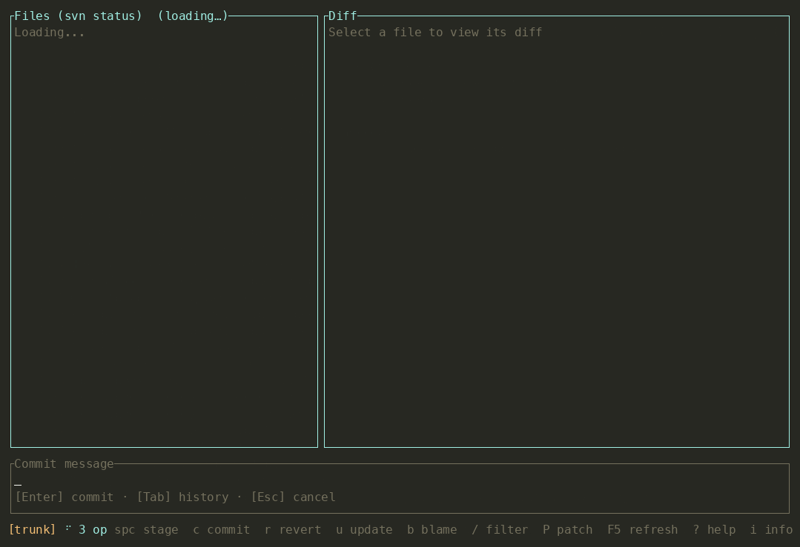
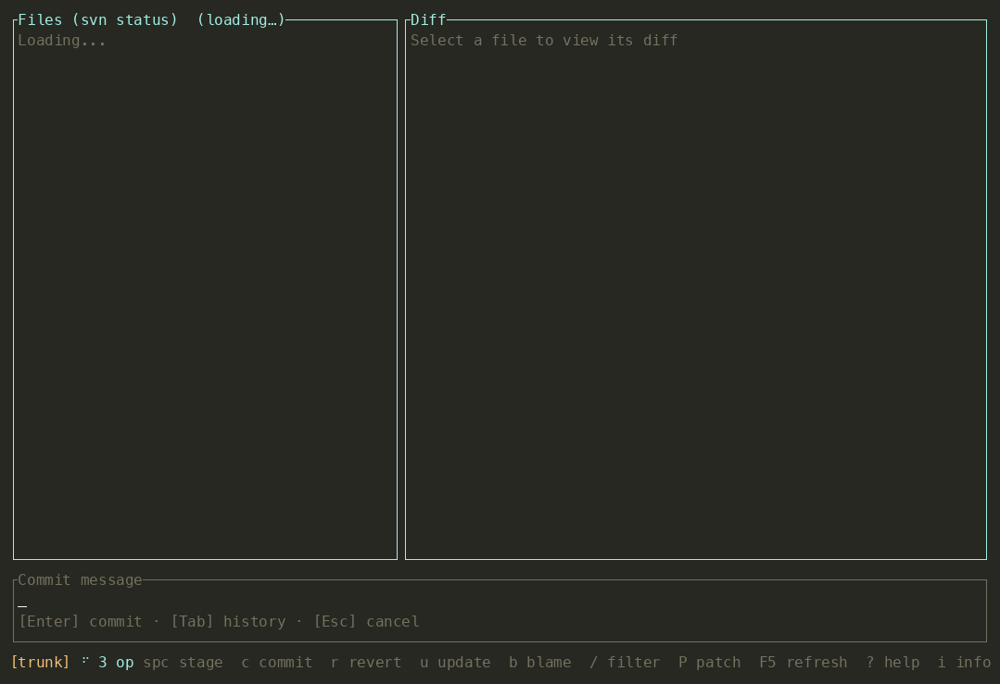
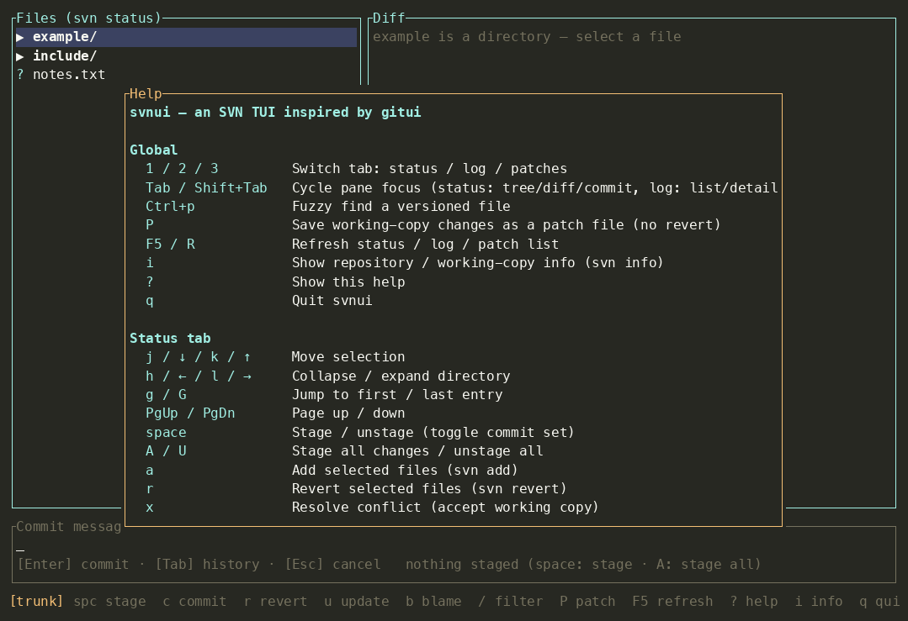
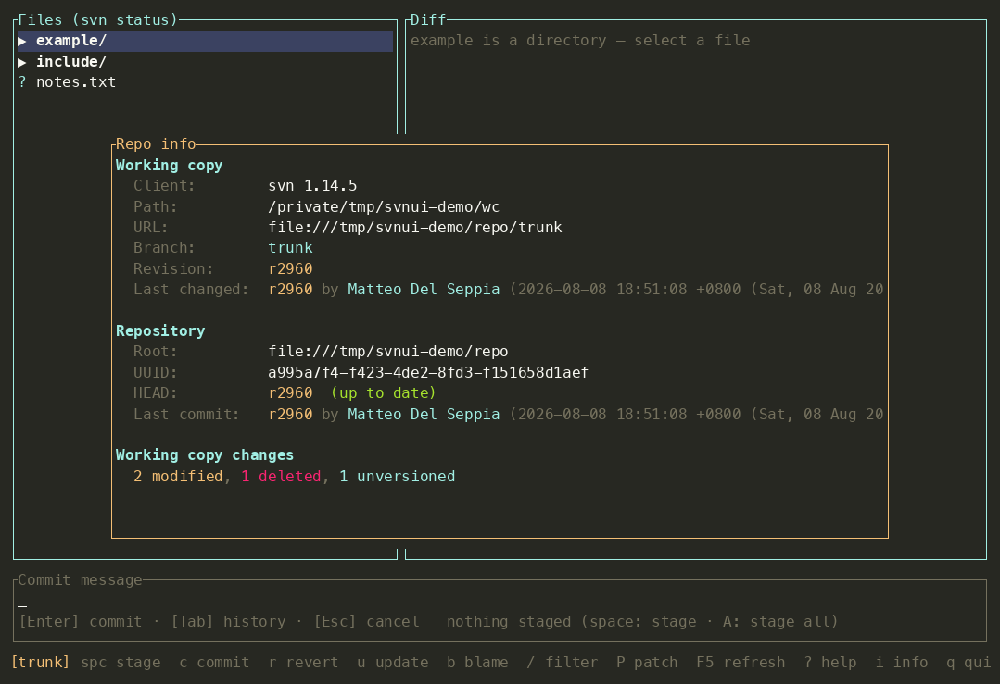

# svnui

中文 | [English](README_EN.md)

一个受 [gitui](https://github.com/gitui-org/gitui) 启发的 SVN (Subversion) 终端 UI 客户端，使用 Rust + [ratatui](https://github.com/ratatui/ratatui) 编写。


## 功能

覆盖日常最常用的 SVN 操作：

| 功能 | 说明 |
| --- | --- |
| **状态视图** | `svn status` 结果按目录树展示，M/A/D/C/? 状态彩色标识，目录可折叠/展开 |
| **分支信息** | 状态栏常驻显示当前分支，提交确认弹窗显示目的分支与将提交的文件列表 |
| **Diff 面板** | 选中文件自动显示 `svn diff`，带行号与 +/− 高亮；未版本化文件直接显示内容 |
| **暂存/提交** | `space` 暂存（加入提交集），`A` 全部暂存，`U` 全部取消；暂存未版本化文件会自动 `svn add`；提交集为空时拒绝提交。输入框支持中文/宽字符与多行粘贴，`Tab` 可回填最近提交信息 |
| **日志视图** | `svn log -v` 修订列表 + 变更路径与提交信息详情，滚动到底部自动加载更早的修订（分页，每次 50 条）；`/` 弹出搜索框（输入时实时筛选当前列表，回车用 `svn log --search` 搜索全部历史，同样支持滚动分页）；`space` 标记多个修订后 `d`/`Enter` 查看合并 diff |
| **文件历史** | `t` 查看选中文件的 `svn log` 历史，弹窗内 `Enter` 直接看该修订 diff，`b` 查看该文件 Blame |
| **文件搜索** | `Ctrl+p` fzf 式模糊搜索文件，命中字符高亮，回车跳转到该文件的历史，`Ctrl+b` 查看该文件 Blame |
| **Blame** | `svn blame` 按修订号着色显示（状态树 `b`、文件历史弹窗 `b`、文件搜索 `Ctrl+b`）；弹窗内 `j/k` 移动光标行，`Enter` 查看该行修订的 diff |
| **还原** | `svn revert`（带确认） |
| **更新** | `svn update`、更新到指定修订（`svn update -r N`，均带确认，确认弹窗显示将更新的工作副本路径） |
| **冲突解决** | `svn resolve --accept=working`（带确认） |
| **补丁管理** | `P` 将工作副本改动保存为带时间戳的补丁文件（`svn diff` 快照，不回滚工作副本）；`3` 打开补丁页浏览（最新在前）、`Enter`/`p` 预览（复用 Diff 弹窗）、`a` 应用（`svn patch`，带确认）、`d` 删除（带确认）。存储目录为平台数据目录，可用环境变量 `SVNUI_PATCH_DIR` 覆盖 |
| **过滤** | `/` 按路径过滤文件（状态页，弹窗输入，实时筛选；Esc 清除已有筛选）/ 搜索提交（日志页） |
| **仓库信息** | `i` 全局快捷键打开仓库概览弹窗：工作副本信息（路径/URL/分支/修订/最后变更）、远端 HEAD 对比（落后多少修订、最后一次提交）、当前改动统计（按状态分类计数 + 提交集大小） |
| **帮助** | `?` 查看全部快捷键 |
| **异步执行** | 所有 svn 命令在后台线程执行，UI 不卡顿，带 spinner 指示 |

## 功能预览（截图与操作录屏）

演示数据为公开的 [spdlog](https://github.com/gabime/spdlog) 提交历史（经 git2svn 转换为 SVN 仓库），
录制管线为 asciinema + agg，脚本见 `scripts/record_demos.sh`（可重复生成下列全部素材）。

| 状态页：目录树 / 暂存提交集 / 路径过滤 | 提交：提交集 + 信息输入 + 确认 |
| --- | --- |
|  |  |

| 日志页：修订 diff / 标记区间 diff / 全历史搜索 | 文件查找 → 文件历史 → Blame → 弹窗内搜索 |
| --- | --- |
|  |  |

| 补丁管理：保存 / 预览 / 还原 / 应用 | 帮助弹窗（`?`） |
| --- | --- |
|  |  |

| 仓库概览（`i`） | |
| --- | --- |
|  | |

## 安装与运行

```bash
# 需要 Rust 工具链和 svn 客户端（>= 1.8；启动时会异步检查版本，过旧会弹警告）
cargo build --release

# 在 SVN 工作副本中运行
svnui
# 或指定目录
svnui /path/to/working-copy
```

## 快捷键

| 按键 | 功能 |
| --- | --- |
| `q` | 退出 |
| `j` / `↓` / `k` / `↑` | 移动选择 |
| `h` / `←` / `l` / `→` | 折叠 / 展开目录 |
| `g` / `G` | 跳到第一项 / 最后一项 |
| `PgUp` / `PgDn` | 翻页 |
| `space` | 暂存 / 取消暂存（切换提交集） |
| `A` / `U` | 全部暂存 / 全部取消暂存 |
| `a` | `svn add` 选中的未版本化文件 |
| `r` | `svn revert` 选中的文件（确认后执行） |
| `x` | 解决冲突（采用工作副本版本） |
| `c` | 聚焦提交信息输入框 |
| `Enter` | 提交（输入框内） |
| `Tab` | 提交输入框内：列出最近提交信息，选中回填 |
| `u` | `svn update` |
| `d` | 全屏 Diff |
| `b` | Blame 文件（状态页 / 文件历史弹窗） |
| `t` | 查看选中文件的提交历史 |
| `Ctrl+p` | 模糊搜索文件（回车查看文件历史） |
| `Ctrl+b` | 文件搜索弹窗：Blame 高亮的文件 |
| `/` | 过滤文件（状态页，弹窗输入，实时筛选）/ 搜索提交（日志页，弹窗输入，回车搜索全部历史）/ Diff、Blame 弹窗内增量搜索文本（实时高亮并滚动到匹配） |
| `n` / `N` | Diff、Blame 弹窗搜索：下一个 / 上一个匹配（循环） |
| `Enter` | Blame 弹窗：查看光标行所属修订的 diff |
| `h` / `l` | Diff、Blame 视图：左右滚动查看过长的行（窄终端） |
| `i` | 查看仓库概览（本地信息 + 远端 HEAD 对比 + 改动统计） |
| `F5` / `R` | 刷新状态 / 日志 / 补丁列表 |
| `P` | 保存工作副本改动为补丁文件（快照，不回滚） |
| `Tab` / `Shift+Tab` | 页内切换面板焦点（状态页：树/Diff/提交框；日志页：列表/详情）；跨标签页用 `1`/`2`/`3` |
| `1` / `2` / `3` | 状态 / 日志 / 补丁 标签页 |
| `Enter` / `d` | 日志页：查看所选（或标记的多个）修订的 diff |
| `space` | 日志页：标记 / 取消标记修订 |
| `o` | 日志页：更新到所选修订 |
| `v` | 日志页：查看完整提交信息 |
| `Enter` / `p` | 补丁页：预览补丁（Diff 视图） |
| `a` | 补丁页：应用补丁（`svn patch`，确认后执行） |
| `d` | 补丁页：删除补丁文件（确认后执行） |
| `?` | 帮助 |
| `Esc` | 关闭弹窗 / 取消 / 清除状态页文件筛选（搜索状态下：先取消输入或清除高亮，再次按下才关闭弹窗） |

## CI/CD

[](https://github.com/LiuYinCarl/svnui/actions/workflows/ci.yml)
[](https://github.com/LiuYinCarl/svnui/actions/workflows/release.yml)

`.github/workflows/` 包含三条流水线：

- **ci.yml** — push / PR 时运行：fmt、clippy（零警告门禁）、Linux/macOS 全量测试、覆盖率门禁（≥ 80%）、三平台 release 构建、压测（matrix 并行跑 13 个不同语言的流行开源仓库——redis / tmux(C)、clap(Rust)、slugify(JS)、ts-node(TS)、requests(Python)、gin(Go)、nlohmann/json(C++)、gson(Java)、jekyll(Ruby)、composer(PHP)、elixir(Elixir)、ohmyzsh(Shell)——各浅克隆 500 个提交后用 git2svn 转成 SVN，无头驱动 App 跑 60 轮随机操作，单 job 限时 15 分钟；日志记录源仓库 commit 以便复现）。
- **bump.yml** — 每次 push 到 master/main 自动运行：将 `Cargo.toml` 的补丁版本号 +1，提交（消息带 `[skip ci]`，避免触发自身流水线）、打 `vX.Y.Z` 标签并推送，随后调用 release.yml 完成发布。同一分支的多次 push 会串行排队执行，排队中的任务开始时先同步分支最新提交，避免算出过期版本号。
- **release.yml** — 推送 `v*` 标签时运行（也供 bump.yml 调用）：校验标签与 `Cargo.toml` 版本一致，在 Linux (x86_64)、macOS (arm64)、Windows (x86_64) 上构建 release 二进制并创建 GitHub Release。

### 发布新版本

日常向 master/main push 即可：bump.yml 会自动 bump 补丁版本并发布，无需手动操作。

想发 minor / major 版本：push 前自己把 `Cargo.toml` 的 `version` 改成目标版本即可（bump 只会在其基础上再 +1 补丁位）。也可以沿用手动标签流程（标签 `vX.Y.Z` 必须与 `Cargo.toml` 版本一致）：

```bash
git tag v0.2.0
git push origin v0.2.0
```

## 性能（超大型 SVN 项目）

针对 10 万+ 文件的工作副本做了针对性优化：

- 文件树构建为 O(n)（一次 HashMap 装配）
- 树 / Diff / Blame 渲染虚拟化：每次绘制只处理可见窗口
- 目录暂存计数缓存，导航时零重算
- `cargo bench --bench tree`（criterion 基准）+ `cargo test perf`（CI 时间门禁，防止复杂度回归）

## 设计说明

架构参考了 gitui：

- `src/main.rs` — 终端初始化、事件循环（`crossbeam_channel::select` 多路复用输入 / 异步 svn 结果 / spinner 时钟）
- `src/app.rs` — 应用状态、标签页、弹窗栈、异步操作分发（对应 gitui 的 `App`/`Gitui`）
- `src/queue.rs` — 组件间事件队列（对应 gitui 的 `Queue` + `NeedsUpdate`）
- `src/svn/` — svn 命令行封装与输出解析（对应 gitui 的 `asyncgit`）：所有操作在线程中执行，通过通道回传结果
- `src/components/` — 文件树、Diff、日志、Blame、提交输入、帮助等组件（对应 gitui 的 `components/`）
- `src/popups/` — 确认、消息、输出查看、全屏 Diff 等弹窗（对应 gitui 的 `popups/`）
- `src/keys.rs` — 快捷键集中定义（对应 gitui 的 `keys/`）

SVN 没有 git 那样的暂存区，因此「暂存」被实现为**提交集**：标记要随下一次提交一起提交的文件；未版本化文件暂存时自动 `svn add`；提交集为空时拒绝提交。

## 测试

```bash
cargo test                 # 单元/集成测试（部分用例会创建真实临时 SVN 仓库）
cargo llvm-cov             # 覆盖率报告（需要 cargo-llvm-cov + llvm-tools-preview）
cargo clippy --all-targets # 零警告
```

测试策略：

- **解析器/模型**：构造 svn 输出样本做单元测试；
- **UI 组件**：用 `ratatui::TestBackend` 离屏渲染 + 合成 crossterm 事件驱动交互；
- **svn 命令层**：测试中 `svnadmin create` 临时仓库，真实执行 status/diff/log/blame/add/revert/commit/update/resolve；
- **App 状态机**：直接喂入 `AsyncSvnNotification` 与 `InternalEvent` 覆盖全部分支，含错误路径；
- **事件循环**：用 `run()` 泛型化 + TestBackend 驱动到退出。

已在 macOS (svn 1.14.5) 上验证完整流程。
